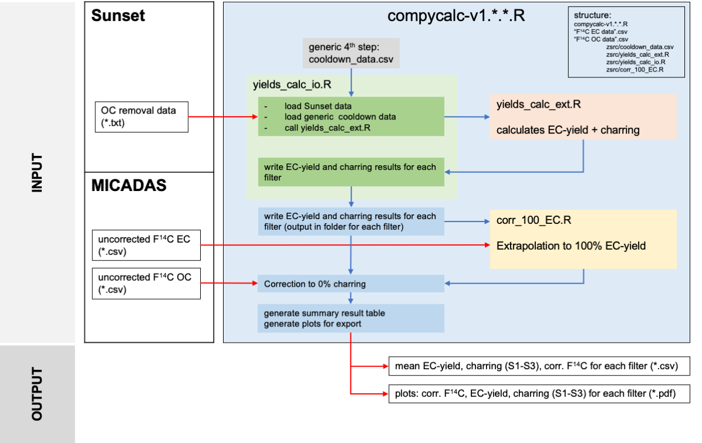

# COMprehensive Yield CALCulation 

#### A tool for EC yield extrapolation and charring correction 

## Describtion

COMPYCALC is a R script for EC yield extrapolation and charring correction. The script uses the the raw data output from a thermo-optical OC/EC analyzer (Model 5L, [Sunset Laboratory Inc.](https://www.sunlab.com), OR, United States) running the Swiss_3S protocol for OC/EC separation developed by [Zhang et al. (2012)](https://doi.org/10.5194/acp-12-10841-2012) for EC yield and charring calculation. Using F<sup>14</sup>C(EC) values measured by accelerator mass spectrometry (AMS) and calculated F<sup>14</sup>OC values, the script performs the EC yield extrapolation to 100% EC yield and a charring correction to 0% charring for F<sup>14</sup>C(EC) values.

##  Usage 

To use the run COMPYCALC program, follow the steps written in the comment section of the `compycalc.R` file. This is the file you want to run, the other files in the subfolder (zsrc) are linked to this script. 

### Step 1: set up environment

In the first section, you are asked to set the working directory, either with the command `setwd()` or by going to Session  &rarr; Set Working Directory  &rarr; To Source File Location if you are using [R Studio](https://rstudio.com). 

```
#set wd-----------------------------------------------------------------------------

# 1)  set the working directory (wd) for COMPYCALC: this folder must contain the compycalc R
#     file and the folder /zsrc containing the scripts. The wd name will be used to name the 
#     result files. 

#setwd("")
```

### Step 2: add OC/EC analyzer files

In the second step, you are ask to add your Sunset raw files in folders to the working directory folder. Obviously, you can also do it the other way around by adding the `compycalc.R` script to the folder where your data is. Now please be aware that the script will take the last digit of each folder for naming, so at best name your folders with xyz-[letter] (xyz-A, xyz-B, …). 

```
#add data---------------------------------------------------------------------------

# 2)  Sunset data
#     Add your folder(s) with the individual Sunset measurement(s) to the wd folder. 

```

### Step 3: add radiocarbon data

Last but not least you have to add the F<sup>14</sup>C(EC) and F<sup>14</sup>OC raw data. These need to be in sample order and in a csv file in the working directory, i.e. the folder where your `compycalc.R` file is. 

```
# 3)  enter F14C EC and OC raw data
          ##EC: import from csv
          F14C_EC_raw_data = read.csv(list.files(".",pattern = "*EC-F14C-raw-data.csv" ,  recursive = TRUE), header = TRUE)
          F14C_EC_raw_data = F14C_EC_raw_data[,]
          #OR enter here manually
          #F14C_EC_raw_data = c()
          
          ##OC: import from csv
          F14C_OC_raw_data = read.csv(list.files(".",pattern = "*OC-F14C-raw-data.csv" ,  recursive = TRUE), header = TRUE)
          F14C_OC_raw_data = F14C_OC_raw_data[,]
          #OR enter here manually
          #F14C_OC_raw_data = c()
```

### Step 4: run code

Finally, you are ready to run the COMPYCALC script. 

```
# 4)  run script
          
#OUTPUT          
#         - each folder with measurements will get three files: "last-digit-of-folder"-mean-results.csv, "last-digit-of-folder"-raw-results.csv, "last-digit-of-folder"-stats.csv
#         - wd folder will get "your-wd-name-here"-mean-summary-with-F14C.csv and "your-wd-name-here"-F14C_and_EC-yield-and-charring-summary.pdf
```

### Step 5: iteration

For best results, it's recommended to run COMPYCALC at least twice to use a corrected F<sup>14</sup>OC. First you use the uncorrected F<sup>14</sup>C(EC) and calculated F<sup>14</sup>OC values (raw data) and run the script, then use the corrected F<sup>14</sup>C(EC) vaule for the calculation  of the first run corrected of F<sup>14</sup>OC. Now run COMPYCALC again with the first run corrected F<sup>14</sup>C(EC) & F<sup>14</sup>OC. With the F<sup>14</sup>C(EC) result of the second run you can calculate the final F<sup>14</sup>OC:
 <br/> <br/>
Initial F<sup>14</sup>C(EC) & F<sup>14</sup>C(OC) &rarr; **first run** of COMPYCALC &rarr; calculation of first run corrected of F<sup>14</sup>OC &rarr; **second run** of COMPYCALC &rarr; **final F<sup>14</sup>C(EC)** and calculation of **final F<sup>14</sup>C(OC)**
<br/> 

After this iteration the differences should be minuscule and you can use the final F<sup>14</sup>C(EC) and F<sup>14</sup>C(OC) values. 

## How does COMPYCALC work?

COMPYCALC (COMprehensive Yield CALCulation) consists of three subscripts for data input and output, EC yield and charring, as well as an extrapolation of the F<sup>14</sup>C(EC) values to 100% EC yield. For each sample, the OC/EC analyzer raw data files containing the laser transmission signal for each OC removal run need to be in a designated subfolder. Additionally, the script requires the uncorrected F<sup>14</sup>C(EC) and F<sup>14</sup>C(OC) data in separate files (csv format) in the main folder. The data input and output script loads the OC/EC analyzer raw data files for each sample folder and initiates the calculation with the EC yield and charring script. The results written in each sample folder is then read by the main script and forwarded to the second calculation script for the extrapolation to 100% EC yield. Finally, the F<sup>14</sup>C(EC) value extrapolated to 100% EC yield is corrected for charring in the main script, as this should be regarded as an OC contamination of the measured EC. After all calculations, a summary data file (csv) with overall EC yield, the charring contribution for each OC removal step (S1, S2, S3), the total charring contribution as well as the raw F<sup>14</sup>C(EC), F<sup>14</sup>C(EC) extrapolated to 100% EC yield, and F<sup>14</sup>C(EC) extrapolated to 100% EC yield and corrected for charring is generated as an output. Additionally, a summary pdf is generated with plots for all F<sup>14</sup>C results, EC yields, and charring for each step (S1, S2, S3). 



## Authors

This tool was written by [Martin Rauber](https://www.martin-rauber.com) and [Gary Salazar](mailto:gary.salazar@dcb.unibe.ch) for LARA, the [Laboratory for the Analysis of Radiocarbon with AMS](https://www.14c.unibe.ch) at the University of Bern. Please get in touch for any bug fixes and suggestions!

## Licence

COMPYCALC is released under the [MIT License](LICENCE.txt).

